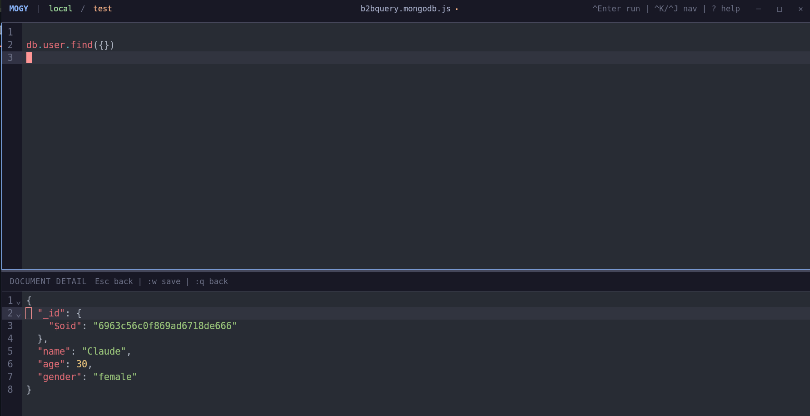

# Mogy

A keyboard-driven MongoDB query UI with first-class Vim support.

Built with Tauri v2 + React + CodeMirror.



## Features

- **First-class Vim support** - Full vim mode in the editor with `jk` to exit insert mode, `:w` to save
- **Keyboard-driven** - Navigate everything with `j/k`, `h/l`, `g/G`, and leader key (`Ctrl+Space`)
- **Query execution** - Run MongoDB queries: `.find()`, `.aggregate()`, `.updateMany()`, `.count()`, etc.
- **Connection management** - Save and manage multiple MongoDB connections
- **Session persistence** - Remembers your last connection, database, collection, and editor content
- **Query files** - Save/load query scripts for reuse

## Keybindings

| Key | Action |
|-----|--------|
| `Ctrl+Enter` | Run query |
| `Ctrl+K` | Focus editor |
| `Ctrl+J` | Focus results |
| `Ctrl+N / Ctrl+P` | Next / previous page |
| `Ctrl+Shift+N` | Last page |
| `Ctrl+Shift+P` | First page |
| `Shift+H` | Table view |
| `Shift+L` | JSON view |
| `Ctrl+Space` then... | Leader key |
| `a` | Open connections |
| `d` | Open databases |
| `o` | Open collections |
| `m` | Toggle maximize |
| `l` | Load query file |
| `c` | Create new query file |
| `?` | Show help |

### Vim Editor

- `jk` - Exit insert mode
- `:w` - Save query file
- `:q` - Close detail view

## Configuration

### Settings File

Create `~/.config/mogy/settings.json` to override keybindings:

```json
{
  "keybindings": {
    "runQuery": "ctrl+Enter",
    "focusEditor": "ctrl+k",
    "focusResults": "ctrl+j",
    "nextPage": "ctrl+n",
    "prevPage": "ctrl+p",
    "firstPage": "ctrl+shift+p",
    "lastPage": "ctrl+shift+n",
    "tableView": "shift+h",
    "jsonView": "shift+l",
    "showHelp": "?",
    "leader": "ctrl+space",
    "leader.connections": "a",
    "leader.databases": "d",
    "leader.collections": "o",
    "leader.maximize": "m",
    "leader.loadFile": "l",
    "leader.newFile": "c"
  }
}
```

Only specify keys you want to change. The default keybindings will be used for anything not specified.

## Supported Query Methods

Mogy supports various MongoDB collection methods:

- `.find()` - Find documents
- `.aggregate()` - Run aggregation pipeline
- `.count()` - Count documents
- `.deleteOne()` / `.deleteMany()` - Delete documents
- `.insertOne()` / `.insertMany()` - Insert documents
- `.updateOne()` / `.updateMany()` - Update documents
- `.replaceOne()` - Replace a document
- `.distinct()` - Get distinct values
- `.findOne()` - Find single document
- `.findOneAndUpdate()` / `.findOneAndDelete()` / `.findOneAndReplace()` - Find and modify

Example queries:

```javascript
db.users.find({ age: { $gt: 18 } })
db.users.aggregate([{ $match: { status: "active" } }, { $group: { _id: "$country", count: { $sum: 1 } } }])
db.activities.updateMany({ status: "old" }, { $set: { status: "archived" } })
```

## Installation

### From Release

Download the latest release for Linux:

- **Linux**: `.deb` or `.AppImage`

### Build from Source

```bash
# Install dependencies
bun install

# Development
bun run tauri dev

# Build
bun run tauri build
```

## Tech Stack

- **Frontend**: React 19 + TypeScript + Vite
- **Backend**: Rust + Tauri v2
- **Editor**: CodeMirror 6 + @replit/codemirror-vim
- **Database**: MongoDB Rust Driver
- **UI**: Tailwind CSS (Catppuccin Mocha theme)

## License

MIT
